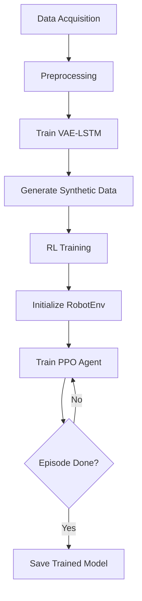

# Bridging the Sim-to-Real Gap in Robotic Assembly Using Generative AI and RL

[](https://opensource.org/licenses/MIT)
[](https://www.python.org/)
[](https://pytorch.org/)

This repository contains the source code and related materials for my master's thesis:  
**"Leveraging Generative AI and Reinforcement Learning to Improve Robot-based Assembly Task Simulations"**  
*Deggendorf Institute of Technology, 2025*

## 📝 Abstract
This repository contains the complete implementation of a novel two-stage approach combining:
1. **VAE-LSTM models** for synthetic force/torque data generation
2. **Proximal Policy Optimization (PPO)** for RL-based control policy training

Key achievements:
- **98.98% MSE improvement** in synthetic force data realism vs physics-based simulation
- Successful sim-to-real transfer learning for robotic assembly tasks
- Custom `RobotEnv` Gym environment for RL training

## 🚀 Quick Start

### Prerequisites
- Python 3.8+
- NVIDIA GPU (recommended)

### Installation
```bash
git clone https://github.com/josephlinoy123/Robotic-Assembly-Sim2Real.git
cd Robotic-Assembly-Sim2Real
pip install -r requirements.txt
```

### Dataset Preparation
1. Download [CSIRO Manipulation Benchmark Dataset](https://research.csiro.au/robotics/manipulation-benchmark/)
2. Place raw data in `data/real/` & `data/simulated/`

## 🧠 Model Architecture
### Two-Stage Methodology

## 💻 Usage
### 1. Generate Synthetic Data
```bash
# Train ForceVAE model
python src/vae_lstm/train.py --config configs/force_vae.yaml

# Generate synthetic trajectories
python src/vae_lstm/generate_data.py --task 01 --output data/generated/
```

### 2. Train RL Agent
```bash
python src/rl_training/train_ppo.py \
  --env RobotEnv-v1 \
  --total_timesteps 1000000 \
  --log_dir logs/
```

## 📂 Folder Structure
```
robot/                   # Project root
├── data/                # RAW data
│   ├── real/            # As-is
│   └── simulated/       # As-is
├── output_split_models/ # Generates outputs
│   ├── force/           # Saves .pth files
│   ├── torque/          # Saves .pth files
│   ├── generated/       # Saves .npy files
│   ├── metrics/         # Saves CSVs
│   ├── plots/           # Saves PNGs
│   └── rl_models/       # Saves PPO.zip
├── src/                 # NEW: All executable code
│   ├── vae_lstm/        # VAE components
│   │   ├── train.py     
│   │   ├── generate.py
│   │   └── models.py
│   └── rl_training/     # RL components
│       ├── train_ppo.py
│       └── environments.py
```

## 📚 Citation
If you use this work in your research, please cite:
```bibtex
@mastersthesis{Arakkal2025Sim2Real,
  author  = {Joseph Linoy Arakkal},
  title   = {Leveraging Generative AI and Reinforcement Learning to Improve Robot-based Assembly Task Simulations},
  school  = {Deggendorf Institute of Technology},
  year    = {2025},
  url     = {https://github.com/josephlinoy123/Robotic-Assembly-Sim2Real}
}
```

## 📜 License
This project is licensed under the MIT License - see the [LICENSE](LICENSE) file for details.

## 🙏 Acknowledgments
- Supervisors: Mr. Ginu Paul Alunkal and Dr. Alper Yaman
- Dataset providers: CSIRO Robotics
