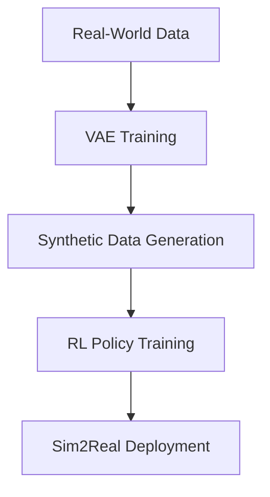

# Bridging the Sim-to-Real Gap in Robotic Assembly Using Generative AI and RL

[](https://opensource.org/licenses/MIT)
[](https://www.python.org/)
[](https://pytorch.org/)

This repository contains the source code and related materials for my master's thesis:  
**"Leveraging Generative AI and Reinforcement Learning to Improve Robot-based Assembly Task Simulations"**  
*Deggendorf Institute of Technology, 2025*

## 📝 Abstract
This repository contains the complete implementation of a novel two-stage approach combining:
1. **VAE-LSTM models** for synthetic force/torque data generation
2. **Proximal Policy Optimization (PPO)** for RL-based control policy training

Key achievements:
- **98.98% MSE improvement** in synthetic force data realism vs physics-based simulation
- Successful sim-to-real transfer learning for robotic assembly tasks
- Custom `RobotEnv` Gym environment for RL training

## 🚀 Quick Start

### Prerequisites
- Python 3.8+
- NVIDIA GPU (recommended)

### Installation
```bash
git clone https://github.com/josephlinoy123/Robotic-Assembly-Sim2Real.git
cd Robotic-Assembly-Sim2Real
pip install -r requirements.txt
```

### Dataset Preparation
1. Download [CSIRO Manipulation Benchmark Dataset](https://research.csiro.au/robotics/manipulation-benchmark/)
2. Place raw data with structure:
```bash
data/
├── real/
│   ├── Task01_real.csv
│   ├── Task02_real.csv
│   └── ...
└── simulated/
    ├── Task01_sim.csv
    ├── Task02_sim.csv
    └── ...
```

## 🧠 Model Architecture
### Two-Stage Methodology

## 💻 Usage
### 1. Generate Synthetic Data
```bash
# Train ForceVAE Model
python src/vae_lstm/train.py \
  --config configs/force_vae.yaml \
  --model-type force

# Train TorqueVAE Model  
python src/vae_lstm/train.py \
  --config configs/torque_vae.yaml \
  --model-type torque

# Generate Synthetic Trajectories (All Tasks)
python src/vae_lstm/generate.py \
  --output output_split_models/generated/
```

### 2. Train RL Agent
```bash
python src/rl_training/train_ppo.py \
  --data output_split_models/generated/ \
  --output output_split_models/rl_models/ \
  --timesteps 1000000 \
  --lr 0.0003
```

### 3. Evaluate RL Agent
```bash
python src/rl_training/evaluate.py \
  --model output_split_models/rl_models/ppo_robot \
  --data output_split_models/generated/ \
  --output output_split_models/metrics/ \
  --episodes 10
```

## 📂 Folder Structure
```
Robotic-Assembly-Sim2Real/
├── data/                   # Raw datasets
│   ├── real/               # Real-world measurements
│   └── simulated/          # Physics-based simulations
├── output_split_models/    # Generated outputs
│   ├── force/              # ForceVAE checkpoints
│   ├── torque/             # TorqueVAE checkpoints
│   ├── generated/          # Synthetic trajectories (.npy)
│   ├── metrics/            # Evaluation metrics
│   ├── plots/              # Comparison visualizations
│   └── rl_models/          # Trained PPO policies
├── src/                    # Source code
│   ├── vae_lstm/           # Generative models
│   │   ├── train.py        # Training script
│   │   ├── generate.py     # Data generation
│   │   └── models.py       # VAE architectures
│   └── rl_training/        # RL components
│       ├── train_ppo.py    # PPO training
│       ├── evaluate.py     # Policy evaluation
│       ├── environments.py # RobotEnv implementation
│       └── __init__.py     # Package definition
├── configs/                # Training configurations
├── requirements.txt        # Python dependencies
└── LICENSE
```

## 📚 Citation
If you use this work in your research, please cite:
```bibtex
@mastersthesis{Arakkal2025Sim2Real,
  author  = {Joseph Linoy Arakkal},
  title   = {Leveraging Generative AI and Reinforcement Learning to Improve Robot-based Assembly Task Simulations},
  school  = {Deggendorf Institute of Technology},
  year    = {2025},
  type    = {Master's thesis},
  url     = {https://github.com/josephlinoy123/Robotic-Assembly-Sim2Real}
}
```

## 📜 License
This project is licensed under the MIT License - see the [LICENSE](LICENSE) file for details.

## 🙏 Acknowledgments
- Supervisors: Mr. Ginu Paul Alunkal and Dr. Alper Yaman
- Dataset providers: CSIRO Robotics
